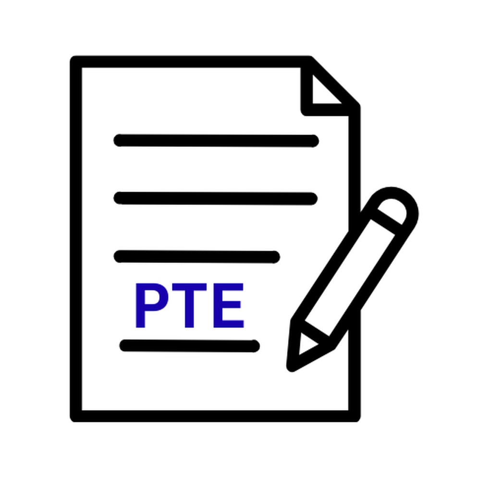

# 📘 PTE Analyzer 
(code name: Exam Analyzer)

**Exam Analyzer** is a Flutter-based utility that helps users track, analyze, and reflect on their PTE (Pearson Test of English) exam performance. Built with a clean MVVM architecture, it offers visual insights, scoring history, and progress tracking in a privacy-first local environment.

# ⛶ Screenshots
<p float="left">
  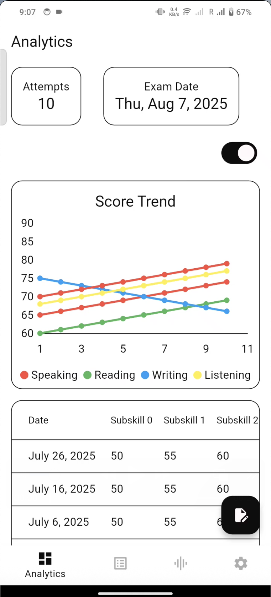
  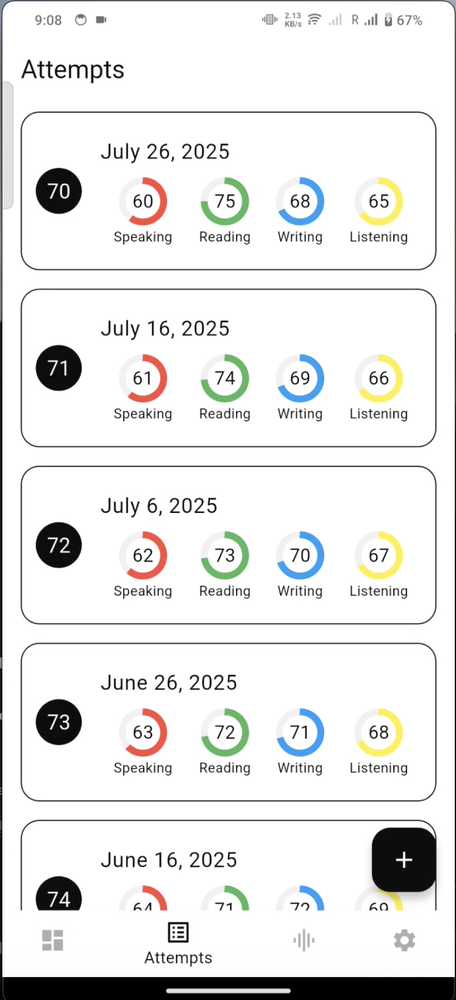
  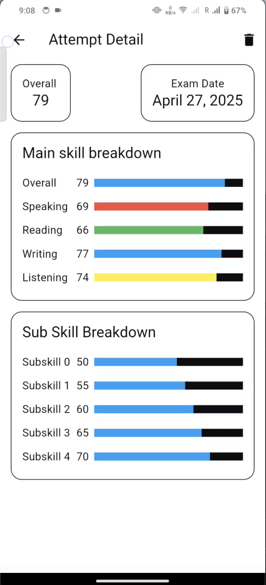
  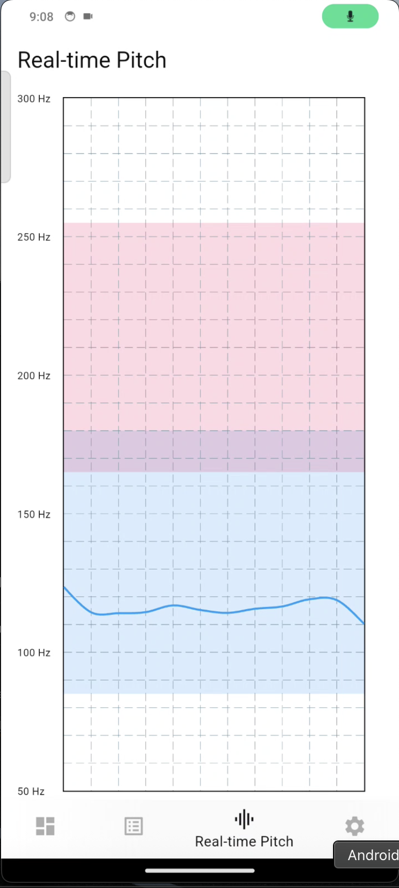
  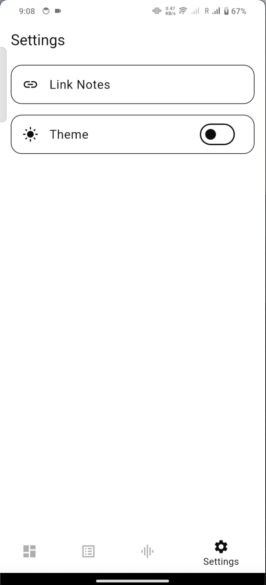
</p>
<p float="left">
  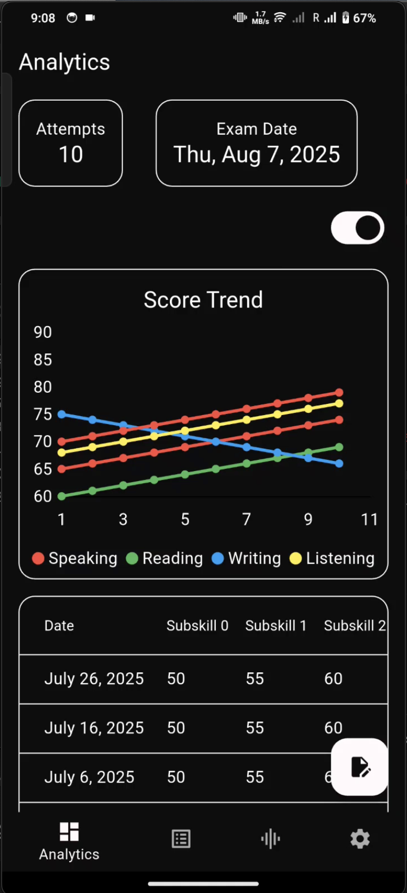
  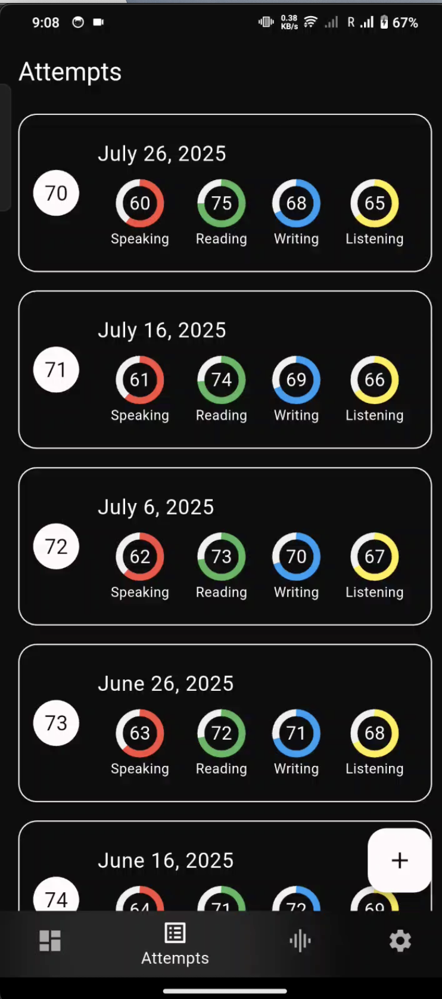
  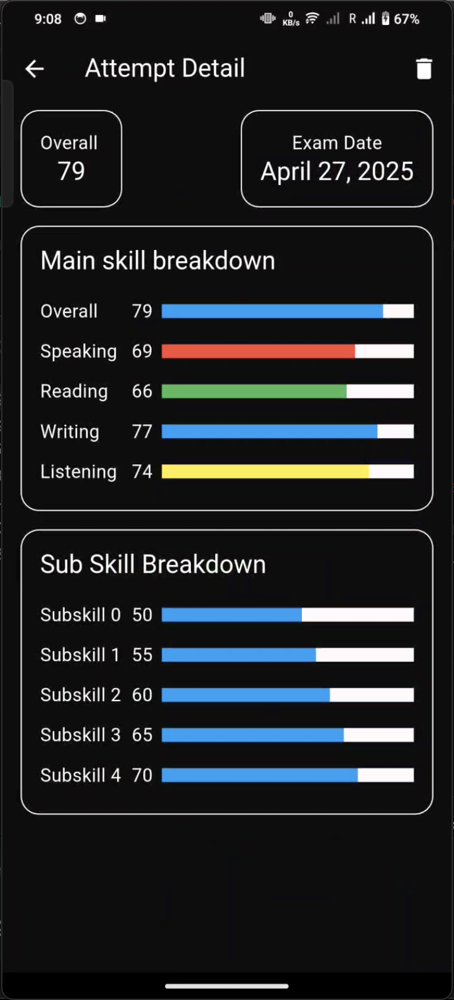
  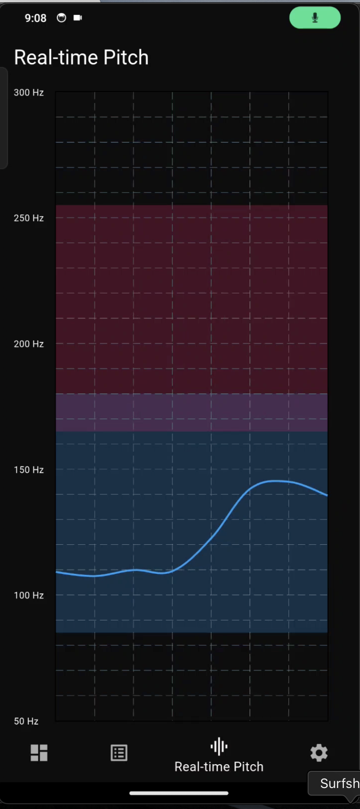
  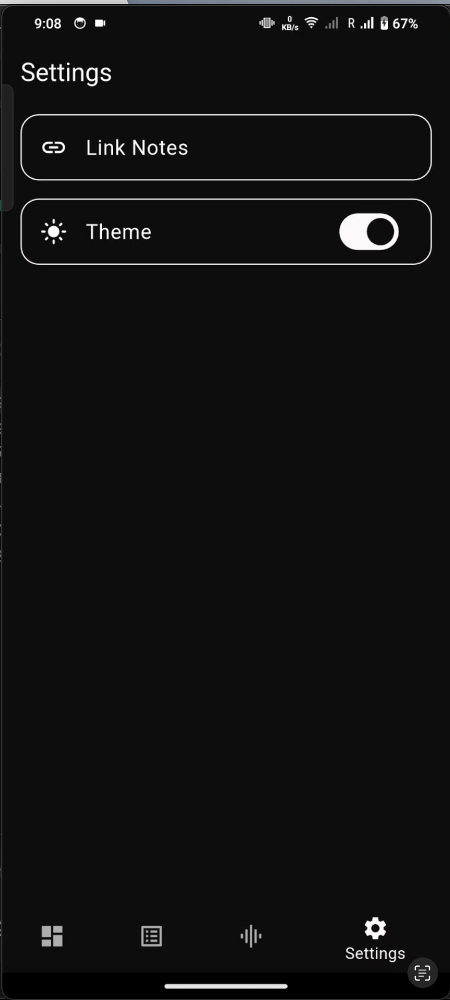
</p>

---

## 🖥️ Platform Support

| Platform   | Supported |
|------------|-----------|
| Android    | ✅        |
| iOS        | ✅        |
| macOS      | ⬜ Planned|
| Windows    | ⬜ Planned |
| Linux      | ⬜ Planned |
| Web        | ⬜ Planned |

## 🚀 Features

- 📊 **Dashboard**: Visual overview of past attempts and upcoming exam date  
- ➕ **Attempts**: Add, delete and keep track of user exam attempts  
- 📁 **View Details**: Deep dive into individual attempts with subskill breakdown  
- 📅 **Next Exam**: Track and update your scheduled exam date  
- 🎙️ **audio**: Real-time pronunciation feedback, detect pitch of the user
- 💡 **Offline-first**: All data stored locally using SQLite  

---

## 🧱 Architecture

- **Flutter**: UI layer  
- **MVVM**: ViewModel + Repository pattern for business logic  
- **Provider + flutter_command**: For state management  
- **Freezed & json_serializable**: For immutable models  
- **go_router**: Declarative navigation  

---

## 💻 Installation

```bash
git clone https://github.com/purushyb/exam-analyzer.git
cd exam-analyzer
flutter pub get
flutter run
````
---

## 🤝 Contributions
- We welcome feedback, feature requests, and security disclosures.
- Check [Contributions.md](.github/CONTRIBUTING.md)

## 📬 Contact Us

### 📨 Email

Feel free to reach out via email at:

**contactus@karnaforge.dev**
